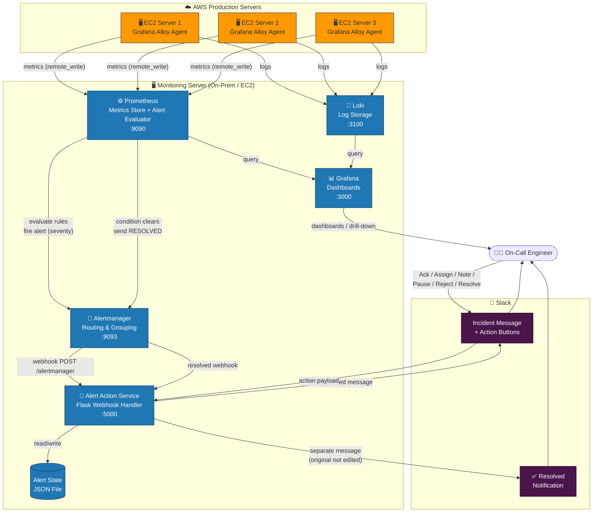
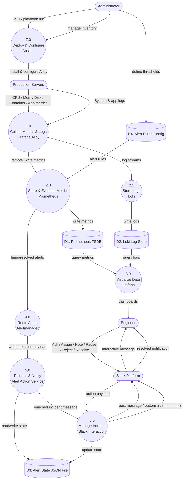
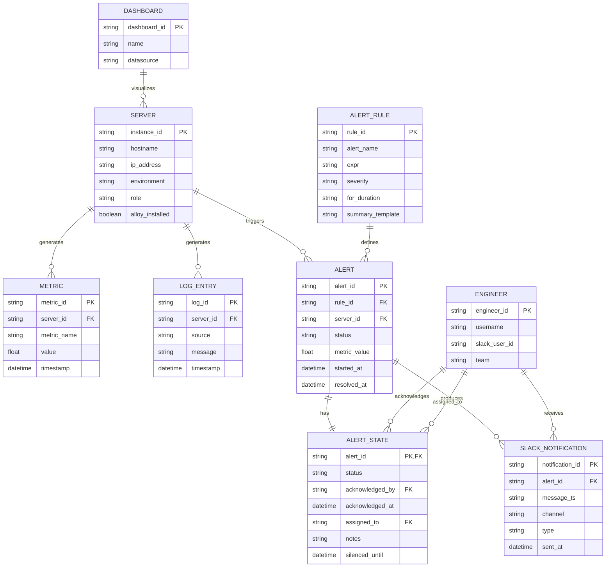
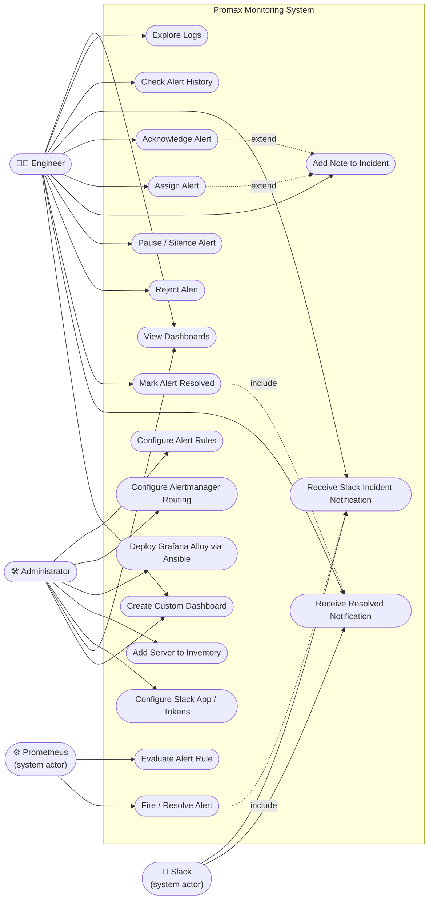

# Promax Production Monitoring System

[](https://github.com)
[](LICENSE)
[](https://www.linux.org)
[](https://www.docker.com)

A **production-grade, centralized monitoring and alerting platform** for Promax on-premises servers with real-time dashboards, intelligent alerting, and interactive incident management via Slack.

[Features](#features) • [Quick Start](#quick-start) • [Architecture](#architecture) • [Deployment](#deployment) • [Troubleshooting](#troubleshooting)

---

## 📋 Table of Contents

- [Overview](#overview)
- [Features](#features)
- [System Architecture](#system-architecture)
- [Components](#components)
- [Complete Workflow](#complete-workflow)
- [System Diagrams (DFD / ERD / Use Case)](#system-diagrams-dfd--erd--use-case)
- [Deployment Guide](#deployment-guide)
- [Configuration](#configuration)
- [Monitoring & Dashboards](#monitoring--dashboards)
- [Alert Management](#alert-management)
- [Troubleshooting](#troubleshooting)
- [Security](#security)
- [Quick Reference](#quick-reference)

---

## 📌 Overview

> **Purpose:** A production-style, centralized monitoring and alerting platform for Promax/on-premises servers.
>
> This document is written so that a **new engineer can understand the system from zero**, deploy it, test it, and troubleshoot it **without needing to know the original implementation history**.

The Promax Monitoring System continuously watches:
- 🖥️ Servers
- 🐳 Containers & applications  
- 💾 Databases & system resources
- 📝 Logs & events

When something goes wrong, the system automatically detects, alerts, and enables engineers to manage incidents directly from Slack.

---

## ✨ Features

| Feature | Description |
|---------|-------------|
| **🔍 Real-time Monitoring** | Continuous collection of metrics, logs, and system telemetry |
| **📊 Rich Dashboards** | Pre-built Grafana dashboards for servers, containers, databases, and applications |
| **🚨 Intelligent Alerting** | Rule-based alert evaluation with configurable thresholds and routing |
| **🎯 Interactive Incidents** | Acknowledge, assign, pause, or resolve alerts directly from Slack |
| **📱 Slack Integration** | Native Slack workflow with buttons, notes, and incident tracking |
| **🤖 Automated Actions** | Convert alert signals into actionable Slack notifications |
| **🔐 Enterprise Security** | Role-based access, token protection, and audit-ready logs |
| **⚙️ Infrastructure as Code** | Ansible-driven deployment for consistency and repeatability |

---

## 📐 System Architecture

```
                         ┌─────────────────────────┐
                         │   Promax Servers        │
                         │                         │
                         │ Metrics + Logs          │
                         └────────────┬────────────┘
                                      │
                                      ▼
                         ┌─────────────────────────┐
                         │   Grafana Alloy         │
                         │  (Collection Agent)     │
                         └────────────┬────────────┘
                                      │
                        ┌─────────────┴─────────────┐
                        ▼                           ▼
           ┌──────────────────────┐    ┌──────────────────────┐
           │    Prometheus        │    │       Loki           │
           │    Metrics Store     │    │    Log Storage       │
           │    Alert Evaluator   │    │                      │
           └──────────┬───────────┘    └──────────┬───────────┘
                      │                           │
                      └────────────┬──────────────┘
                                   ▼
                        ┌──────────────────────┐
                        │      Grafana         │
                        │    Dashboards        │
                        └──────────────────────┘

                   ALERT FLOW (Detection → Action)

                      Prometheus
                           │
                           ▼
                      Alertmanager
                           │
                           ▼
                  Alert Action Service
                           │
                           ▼
                         Slack
                  ┌────────┼────────┐
                  ▼        ▼        ▼
            Engineer   Actions   Resolution
```

### 🖼️ Visual System Diagram (AWS Servers → Monitoring Stack → Slack)



### Monitoring Flow Overview

```
Production Servers
       ↓ (Metrics + Logs)
Grafana Alloy
       ├──→ Prometheus (Metrics)
       └──→ Loki (Logs)
           ↓
       Grafana (UI)

Alert Path:
Prometheus → Alertmanager → Alert Action Service → Slack → Engineer Actions
```

---

## 🏗️ Components

| Component | Purpose | Port | Runs On |
|-----------|---------|------|---------|
| **Grafana Alloy** | Collects metrics and logs from monitored servers | `12345` | Monitored servers |
| **Prometheus** | Stores and evaluates metrics; fires alerts | `9090` | Monitoring server |
| **Loki** | Centralizes and stores logs | `3100` | Monitoring server |
| **Grafana** | Web dashboards and visualizations | `3000` | Monitoring server |
| **Alertmanager** | Groups, routes, fires, and resolves alerts | `9093` | Monitoring server |
| **Alert Action Service** | Converts alerts into interactive Slack workflows | `5000` | Monitoring server |
| **Slack** | Incident notification and operator interaction | N/A | Cloud |
| **Ansible** | Installs and configures Alloy on servers | N/A | Admin machine |

---

## 🔄 Complete Monitoring Workflow

### **Step 1: Server Produces Telemetry**

Production servers generate metrics and logs:

```
CPU = 96%
Memory = 82%  
Disk = 91%
Network Traffic = 850 Mbps
```

### **Step 2: Alloy Collects Data**

Grafana Alloy runs on each server and collects:

```
Linux Server
     ├─→ CPU/Memory/Disk metrics → Alloy
     ├─→ Docker container metrics → Alloy
     ├─→ Application metrics → Alloy
     └─→ System logs → Alloy
```

### **Step 3: Data Reaches Monitoring Server**

Metrics are sent to Prometheus and logs to Loki via remote_write:

```
Alloy → Prometheus (metrics)
Alloy → Loki (logs)
```

### **Step 4: Grafana Visualizes Data**

Grafana reads both datasources and displays dashboards:

```
Prometheus ┐
           ├─→ Grafana Dashboard
Loki ──────┘
```

### **Step 5: Prometheus Evaluates Alert Rules**

Example alert rule:

```yaml
CPU > 90% for 5 minutes → FIRING
Memory > 85% for 10 minutes → FIRING
Disk > 90% for 15 minutes → FIRING
```

### **Step 6: Alertmanager Receives Alert**

Prometheus sends firing alerts to Alertmanager:

```
Prometheus → Alertmanager
             (severity: critical/warning)
```

### **Step 7: Alertmanager Routes Alert**

Routing rules determine destination:

```
if severity == "critical" → Critical Receiver (Slack)
if severity == "warning"  → Warning Receiver (Slack)
```

### **Step 8: Alert Action Service Processes**

Custom Flask service receives webhook from Alertmanager:

```
Alertmanager → Alert Action Service (http://localhost:5000/alertmanager)
```

### **Step 9: Create Interactive Slack Incident**

Service creates enriched Slack message with:

- ✅ Alert name and severity
- 📍 Affected server/instance
- 📊 Metric value and threshold
- ⏱️ Duration and start time
- 🔗 Grafana dashboard link
- 🔗 Prometheus graph link
- 📋 Runbook link (if available)
- 🎯 Action buttons (below)

### **Step 10: Engineer Handles Incident**

Available actions in Slack:

```
[Acknowledge]  [Pause/Silence]  [Reject]  [Add Note]  [Assign]  [Mark Resolved]
```

Actions are stored in a JSON state file so context is preserved.

### **Step 11: Problem is Fixed**

Server metric returns to normal:

```
CPU: 96% → 78% → 45%
(no longer triggers alert condition)
```

### **Step 12: Alertmanager Sends Resolved Event**

Prometheus evaluates alert as resolved and notifies Alertmanager:

```
Prometheus → Alertmanager: "Alert is now RESOLVED"
```

### **Step 13: Separate Resolution Notification**

Original firing message is **not** rewritten. Instead, a separate message is posted:

```
✅ RESOLVED: High CPU Usage
   Server: prod-app-01
   Duration: 8 minutes 32 seconds
   Timestamp: 2024-01-15 14:23:15 UTC
```

This keeps incident history clean and easy to understand.

---

## 📊 System Diagrams (DFD / ERD / Use Case)

### 1️⃣ Data Flow Diagram (DFD)

Shows how telemetry and alert data move between external entities, processes, and data stores.



### 2️⃣ Entity Relationship Diagram (ERD)

Logical data model for servers, metrics, alerts, alert state, engineers, and Slack notifications.



### 3️⃣ Use Case Diagram

Actors and their interactions with the monitoring platform.



---

## 🚀 Deployment Guide

### **Prerequisites**

- Monitoring server: Ubuntu/Debian 20.04+, 4GB RAM minimum
- Monitored servers: Linux (Ubuntu/Debian/CentOS/RHEL)
- Docker & Docker Compose installed
- Ansible 2.9+
- Slack workspace with admin access

### **Deployment Order (From Zero)**

```
1. Prepare monitoring server
       ↓
2. Install Docker
       ↓
3. Deploy Prometheus
       ↓
4. Deploy Grafana
       ↓
5. Deploy Loki
       ↓
6. Deploy Alertmanager
       ↓
7. Configure Prometheus alert rules
       ↓
8. Configure Alertmanager routes/webhooks
       ↓
9. Configure Alert Action Service
       ↓
10. Configure Slack application
       ↓
11. Start Alert Action Service
       ↓
12. Configure Ansible
       ↓
13. Add monitored servers to inventory
       ↓
14. Install Grafana Alloy on servers
       ↓
15-21. Verify and test
```

### **Quick Start with Docker Compose**

```bash
# 1. Clone repository
git clone https://github.com/promax-tech/monitoring.git
cd monitoring

# 2. Copy example files
cp .env.example .env
cp prometheus/prometheus.yml.example prometheus/prometheus.yml
cp alertmanager/alertmanager.yml.example alertmanager/alertmanager.yml

# 3. Edit .env with your Slack tokens
# SLACK_BOT_TOKEN=xoxb-...
# SLACK_APP_TOKEN=xapp-...
# SLACK_SIGNING_SECRET=...

# 4. Start all services
docker-compose up -d

# 5. Verify
curl http://localhost:9090     # Prometheus
curl http://localhost:3000     # Grafana (admin/admin)
curl http://localhost:9093     # Alertmanager
curl http://localhost:5000/health  # Alert Action Service
```

---

## ⚙️ Configuration

### **Prometheus Alert Rules**

File: `prometheus/rules/alerts.yml`

```yaml
groups:
  - name: server_alerts
    interval: 30s
    rules:
      - alert: HighCPUUsage
        expr: node_cpu_usage > 90
        for: 5m
        labels:
          severity: critical
        annotations:
          summary: "High CPU usage on {{ $labels.instance }}"
          description: "CPU is {{ $value }}% for more than 5 minutes"
          
      - alert: HighMemoryUsage
        expr: node_memory_usage > 85
        for: 10m
        labels:
          severity: warning
        annotations:
          summary: "High memory usage on {{ $labels.instance }}"
          description: "Memory is {{ $value }}% for more than 10 minutes"
          
      - alert: DiskSpaceRunningOut
        expr: node_disk_usage > 90
        for: 15m
        labels:
          severity: critical
        annotations:
          summary: "Disk space critical on {{ $labels.instance }}"
          description: "Disk usage is {{ $value }}%"
```

### **Alertmanager Routing**

File: `alertmanager/alertmanager.yml`

```yaml
global:
  resolve_timeout: 5m

route:
  receiver: 'default'
  group_by: ['alertname', 'cluster', 'service']
  group_wait: 10s
  group_interval: 10s
  repeat_interval: 12h

  routes:
    - match:
        severity: critical
      receiver: critical
      repeat_interval: 5m
      
    - match:
        severity: warning
      receiver: warning
      repeat_interval: 1h

receivers:
  - name: default
    webhook_configs:
      - url: http://alert-action-service:5000/alertmanager
        send_resolved: true
        
  - name: critical
    webhook_configs:
      - url: http://alert-action-service:5000/alertmanager
        send_resolved: true
        
  - name: warning
    webhook_configs:
      - url: http://alert-action-service:5000/alertmanager
        send_resolved: true
```

### **Ansible Playbook for Alloy Installation**

File: `ansible/playbooks/install-alloy.yml`

```yaml
---
- hosts: all
  become: yes
  roles:
    - alloy
  vars:
    prometheus_server: "monitoring.internal:9090"
    loki_server: "monitoring.internal:3100"
    alloy_config: "/etc/alloy/config.alloy"
```

---

## 📊 Monitoring & Dashboards

### **Pre-built Dashboards**

Grafana includes dashboards for:

- 📈 Server Overview (CPU, memory, disk, network)
- 🐳 Docker Containers
- 🗄️ MySQL/Database metrics
- 🔗 Application metrics
- 📝 Logs exploration
- 🚨 Alert history
- 🔄 System uptime

### **Creating Custom Dashboards**

1. Open Grafana: `http://monitoring-server:3000`
2. Login with admin credentials
3. Click "+" → "Dashboard" → "Add Panel"
4. Select datasource (Prometheus or Loki)
5. Write query: `up{job="node-exporter"}`
6. Visualize and save

### **Example Queries**

```promql
# CPU usage per server
100 - (avg by (instance) (rate(node_cpu_seconds_total{mode="idle"}[5m])) * 100)

# Memory available percentage
(node_memory_MemAvailable_bytes / node_memory_MemTotal_bytes) * 100

# Disk usage percentage
(node_filesystem_size_bytes - node_filesystem_avail_bytes) / node_filesystem_size_bytes * 100

# Network throughput
rate(node_network_transmit_bytes_total[5m])
```

---

## 🚨 Alert Management

### **Alert Lifecycle**

```
PENDING → FIRING → (Engineer action) → ACKNOWLEDGED → RESOLVED
```

### **Alert Actions (Slack)**

| Action | Effect |
|--------|--------|
| **Acknowledge** | Marks alert as acknowledged, updates state |
| **Pause/Silence** | Silences alert for 1 hour (configurable) |
| **Reject** | Dismisses alert, marks as rejected |
| **Add Note** | Adds context/notes to incident |
| **Assign** | Assigns to team member, notifies them |
| **Mark Resolved** | Manually closes incident |

### **State File**

Alert states are persisted in JSON:

```json
{
  "alert_123": {
    "status": "acknowledged",
    "acknowledged_at": "2024-01-15T14:20:00Z",
    "acknowledged_by": "john.doe",
    "notes": "Restarted app server",
    "assigned_to": "ops-team"
  }
}
```

---

## 🔧 Troubleshooting

### **Grafana Alloy is not running**

```bash
sudo systemctl status alloy --no-pager
sudo journalctl -u alloy -f
sudo systemctl restart alloy
```

### **Prometheus is not receiving metrics**

Check targets page:

```bash
# Visit:
http://MONITORING_SERVER_IP:9090/targets

# Verify Alloy configuration:
sudo systemctl status alloy
sudo cat /etc/alloy/config.alloy

# Check network connectivity:
telnet MONITORING_SERVER_IP 9090
```

### **Grafana has no data**

Verify:

1. ✅ Prometheus is running: `curl http://localhost:9090`
2. ✅ Prometheus has data: `http://localhost:9090/graph`
3. ✅ Grafana datasource URL is correct
4. ✅ Time range in Grafana is not in the future

### **Alertmanager is not receiving alerts**

Check Alertmanager UI:

```bash
http://MONITORING_SERVER_IP:9093
```

Then verify Prometheus alert rules:

```bash
curl http://localhost:9090/api/v1/rules
```

### **Slack alert is not appearing**

Check Alert Action Service:

```bash
sudo systemctl status alert-action.service --no-pager
sudo journalctl -u alert-action.service -n 100
curl http://127.0.0.1:5000/health
```

Verify Alertmanager webhook is configured:

```bash
curl http://MONITORING_SERVER_IP:9093/api/v1/status
```

### **Alert Action Service fails to start**

Validate Python syntax:

```bash
cd /opt/promax-monitoring/alert-action
sudo /opt/promax-monitoring/alert-action/venv/bin/python -m py_compile app.py
```

Check systemd unit:

```bash
systemctl cat alert-action.service
systemctl daemon-reload
sudo systemctl restart alert-action.service
```

### **Slack action does not work**

Verify:

- ✅ Slack bot token is valid
- ✅ Slack signing secret matches
- ✅ Slack app token is correct
- ✅ Socket Mode is enabled in Slack app config
- ✅ Channel permissions allow bot to post
- ✅ Interactive action handling is configured

---


### **`.gitignore` Template**

```gitignore
# Environment
.env
.env.local

# SSH/Keys
*.pem
*.key
*.pub

# Python
venv/
__pycache__/
*.pyc
*.egg-info/

# Logs
*.log
logs/

# Sensitive data
passwords.txt
secrets/
```

### **Do Not Commit**

```
SLACK_BOT_TOKEN
SLACK_APP_TOKEN
SLACK_SIGNING_SECRET
SSH private keys
Database passwords
API keys
```

---

## 📁 Repository Structure

```
promax-monitoring/
│
├── README.md
├── docker-compose.yml
├── .env.example
│
├── prometheus/
│   ├── prometheus.yml
│   └── rules/
│       └── alerts.yml
│
├── alertmanager/
│   └── alertmanager.yml
│
├── loki/
│   └── loki-config.yml
│
├── grafana/
│   └── provisioning/
│       ├── datasources/
│       └── dashboards/
│
├── ansible/
│   ├── inventory/
│   │   ├── production.ini.example
│   │   └── test.ini.example
│   ├── playbooks/
│   │   └── install-alloy.yml
│   └── roles/
│       └── alloy/
│           ├── defaults/
│           ├── handlers/
│           ├── tasks/
│           └── templates/
│
└── alert-action/
    ├── app.py
    ├── requirements.txt
    ├── .env.example
    └── alert-action.service.example
```

---

## ⚡ Quick Reference

| Task | Command |
|------|---------|
| **Check Alloy** | `sudo systemctl status alloy --no-pager` |
| **Alloy logs** | `sudo journalctl -u alloy -f` |
| **Restart Alloy** | `sudo systemctl restart alloy` |
| **Alert Action status** | `sudo systemctl status alert-action.service --no-pager` |
| **Alert Action logs** | `sudo journalctl -u alert-action.service -f` |
| **Health check** | `curl http://127.0.0.1:5000/health` |
| **Python syntax** | `python -m py_compile app.py` |
| **Prometheus UI** | `http://MONITORING_SERVER_IP:9090` |
| **Prometheus targets** | `http://MONITORING_SERVER_IP:9090/targets` |
| **Alertmanager UI** | `http://MONITORING_SERVER_IP:9093` |
| **Grafana UI** | `http://MONITORING_SERVER_IP:3000` |
| **CPU stress test** | `stress-ng --cpu 0 --timeout 5m --metrics-brief` |
| **Stop stress test** | `pkill stress-ng` |
| **Ansible ping** | `ansible all -i inventory/production.ini -m ping` |
| **Ansible syntax check** | `ansible-playbook playbooks/install-alloy.yml --syntax-check` |

---

## ✅ Production Readiness Checklist

Before marking as production-ready:

- [ ] Monitoring server has sufficient CPU/RAM/storage (4GB+ RAM, 50GB+ disk)
- [ ] Docker containers use pinned versions (not `latest`)
- [ ] Prometheus retention is configured (30+ days recommended)
- [ ] Loki retention/storage is configured
- [ ] Grafana authentication is secured (strong password, LDAP/OAuth if available)
- [ ] Prometheus/Alertmanager are **not** publicly exposed
- [ ] Alloy is managed by systemd on all monitored servers
- [ ] Alloy configuration is managed by Ansible (Infrastructure as Code)
- [ ] Production inventory is separated from test inventory
- [ ] Alert rules are documented and reviewed
- [ ] Critical and warning routes are tested with real traffic
- [ ] Slack firing notification is tested end-to-end
- [ ] Slack interactive actions (acknowledge, assign, resolve) are tested
- [ ] Pause/silence behavior is tested and timed correctly
- [ ] Resolution notifications appear separately (not overwrites)
- [ ] Logs are available and queryable in Loki
- [ ] All dashboards are available in Grafana
- [ ] Secrets are excluded from Git (verify `.gitignore`)
- [ ] Configuration backups exist and are tested
- [ ] Engineering team is trained on troubleshooting procedures
- [ ] On-call runbooks are documented and accessible
- [ ] Monitoring of the monitoring system itself is in place

---

## 📚 For New Engineers

> **If you only remember one thing, remember this:**
>
> **Alloy collects data → Prometheus/Loki store it → Grafana shows it → Prometheus detects problems → Alertmanager routes them → Alert Action Service turns them into interactive Slack incidents → engineers handle them → the system sends a separate resolved notification when the problem is fixed.**

### **You will interact with three places:**

1. **Grafana** (`http://monitoring:3000`)
   - Investigate what's happening
   - View dashboards and drill down

2. **Prometheus/Alertmanager** (`http://monitoring:9090` / `http://monitoring:9093`)
   - Verify metric and alert state
   - Test alert rules
   - Check alert history

3. **Slack**
   - Acknowledge, assign, pause, reject
   - Add notes and context
   - Follow the incident to resolution

### **Administrators use Ansible:**

- Add or configure monitored servers
- Install Alloy uniformly across fleet
- Avoid manual repetition

---

## 📞 Support & Contribution

For issues, improvements, or questions:

1. Check the [Troubleshooting](#troubleshooting) section
2. Review logs: `journalctl -u [service] -f`
3. Create an issue in the repository
4. Contact the platform engineering team

---

## 📄 License & Ownership

This repository is intended for **Tech Bridge monitoring infrastructure**.

Add your organization's preferred license and operational ownership information before making public.

---

**Last Updated:** 15 sept 2026  
**Version:** 1.0  
**Maintained by:** Ahmad Raza 
